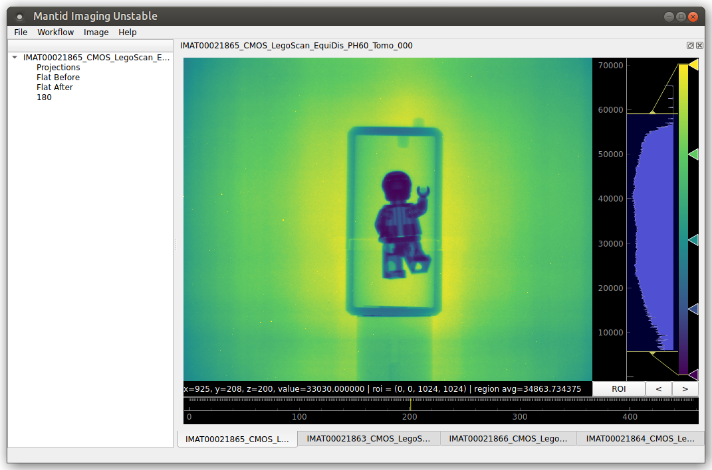

MantidImaging
=============

Mantid Imaging is a graphical toolkit for performing 3D reconstruction of neutron tomography data. It provides an easy-to-use graphical interface to a wide range of pre/post-processing operations, tilt correction and reconstruction algorithms, accommodating for tomography users with varying data complexity and image analysis background knowledge. It utilises a flexible plugin system that allows easy integration of external software, and has allowed us to re-use software widely known in the neutron tomography community.

.. toctree::
   :maxdepth: 1
   :caption: Contents:

   overview
   installation
   user_guide/index
   developer_guide/index
   support
   troubleshooting
   api
   release_notes/index

.. toctree::
   :caption: Links:

   Code Repository <https://github.com/mantidproject/mantidimaging>
   Anaconda Package <https://anaconda.org/mantidimaging/mantidimaging>

Please cite as:
Tasev, Dimitar; Akello-Egwel, Dolica; Allen, Jack; Baust, Rachel; Gigg, Martyn; Jones, Samuel; Nixon, Daniel; Stock, Samuel; Taylor, Will; Tygier, Sam. (2023). Mantid Imaging (2.5.0), Zenodo https://doi.org/10.5281/zenodo.4728059

(See `Zenodo <https://doi.org/10.5281/zenodo.4728059>`_ for citing specific versions).

Sign up to our `mailing list <https://www.jiscmail.ac.uk/cgi-bin/wa-jisc.exe?SUBED1=MANTID-IMAGING-ANNOUNCE&A=1>`_ to receive updates on the project
