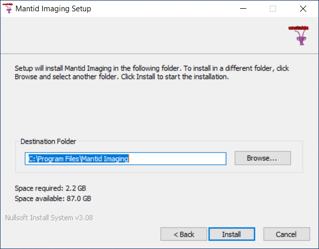

.. _Installation:

Installation
============

There are several options for installing:

- :ref:`Installing with Windows installer` - Simplest method on Windows

- :ref:`Installing with Mamba/Conda` - Linux or Windows. Most flexible. Does not need admin access.

- :ref:`Using Mantid Imaging on IDAaaS` - For ISIS users

- For installation from source see the :ref:`Developer Guide`

Requirements
------------

Operating system
 - Linux. Tested on Ubuntu 18.04, 20.04, 22.04 and CentOS 7
 - Windows. Tested on Windows 10

GPU
   A CUDA capable GPU is required for some operations. CPU alternatives are provided, so it is possible to perform a tomographic reconstruction on a system without a GPU.

RAM
   A large amount of RAM is needed to hold a dataset in memory. A 2k x 2k resolution with 1k projections held as 32 bit floats uses 16 GB of RAM. To perform safe (undoable) operations the requirement is doubled. Requirements scale with increased resolution, projection counts and bit depth.

Installing with Windows installer
---------------------------------

The installer can be downloaded from the releases_ page. For example :code:`MantidImagingSetup_2.5.0.exe`.

Once downloaded, double click the setup file to run the installer. The installer is not currently signed so you may need to click to allow it to run.

Select a directory to install to e.g. :code:`c:\Program Files\Mantid Imaging` and click Install.

Once Mantid Imaging is installed it will show in the start menu.

.. _releases: https://github.com/mantidproject/mantidimaging/releases

Uninstalling
~~~~~~~~~~~~

If Mantid Imaging has been installed using the Windows Installer, then it can be removed by right clicking the entry in the start menu and selecting :code:`Uninstall`.

Installing with Mamba/Conda
---------------------------

Mantid Imaging can be installed using the packages_ published to Anaconda Cloud, this
can be done with an existing Conda or Mamba distribution if you already
have one on your machine.

.. _packages: https://anaconda.org/mantid/mantidimaging/

1. Download and install CUDA Runtime version 10.2 - https://developer.nvidia.com/cuda-10.2-download-archive before installing the Mantid Imaging environment.
2. Download and install `Mambaforge <https://github.com/conda-forge/miniforge>`_ or `Miniconda 3 <https://conda.io/miniconda.html>`_
3. Make sure :code:`mamba` or :code:`conda` is available on your PATH. The steps below assume you are using mamba.
4. Create a mantidimaging conda environment:

  - :code:`mamba env create -f https://raw.githubusercontent.com/mantidproject/mantidimaging/stable/environment.yml`

(Specific versions can be installed by using the release url, e.g. `https://raw.githubusercontent.com/mantidproject/mantidimaging/release-2.2.0/environment.yml`)

5. This creates an environment called :code:`mantidimaging` that you can activate via :code:`conda activate mantidimaging`
6. **This step is required for Linux users only.** To ensure that MantidImaging can make full use of the memory available on your Linux machine, we need to set the shared memory size to an appropriate value. Please follow the steps below to do this:

  - Open the etc/fstab file on your computer. You can do this by opening a terminal and running this command (with sudo if needed to allow you to edit the file): :code:`gedit /etc/fstab`
  - In the open fstab file, try to locate a line like this one: :code:`none /dev/shm tmpfs defaults,size=4G 0 0`.
  - If the line exists:

    - Modify the text after :code:`size=` to replace with :code:`size=90%`. After you have made the change, the line should look like this: :code:`none /dev/shm tmpfs defaults,size=90% 0 0`
    - Save your changes and exit the text editor.
    - In a terminal, run this command (with sudo if needed): :code:`mount -o remount /dev/shm`

  - If the line does NOT exist:

    - At the end of the file, add this line: :code:`none /dev/shm tmpfs defaults,size=90% 0 0`
    - Save your changes and exit the text editor.
    - In a terminal, run this command (with sudo if needed): :code:`mount /dev/shm`

7. [Optional] If you wish to run :code:`mantidimaging-ipython`, you will need to have :code:`ipython` installed. This can be done with the command :code:`mamba install ipython`.

Running the package
~~~~~~~~~~~~~~~~~~~

1. Activate the environment created in the installation step: :code:`mamba activate mantidimaging`
2. Run using one of the following commands:

  - GUI: :code:`mantidimaging`
  - IPython: :code:`mantidimaging-ipython`

Nightly version
~~~~~~~~~~~~~~~

The latest nightly version can be installed with

  - :code:`mamba env create -f https://raw.githubusercontent.com/mantidproject/mantidimaging/main/environment.yml`

This will make a `mantidimaging-nightly` environment.

Updating
~~~~~~~~
To update to the latest version of Mantid Imaging run:

:code:`conda activate mantidimaging && mamba update mantidimaging`

If you see any issues with package compatibility, the fastest solution is reinstalling the environment - see below.

Reinstalling the environment
~~~~~~~~~~~~~~~~~~~~~~~~~~~~
To completely delete the Mantid Imaging environment follow these steps:

- :code:`mamba deactivate`

  - to exit out of the conda Mantid Imaging environment

- :code:`mamba env list`

  - to see which environments you have installed

- :code:`mamba env remove -n mantidimaging`

  - and press :code:`y` to confirm. Replace `mantidimaging` with any other environment you wish to remove

- Follow steps 4 and 5 from Installing_.

Using Mantid Imaging on IDAaaS
------------------------------

If you are an ISIS user then you may have access to the ISIS Data Analysis as a Service (IDAaaS) system.

Mantid Imaging is preinstalled in the IMAT Tomography workspaces.

It can be launched from the menu :code:`Applications > Software > Manntid Imaging`.

.. image:: _static/launch_on_idaaas.png
    :alt: Launching Mantid Imaging on IDAaaS
    :width: 40%
    :align: center

