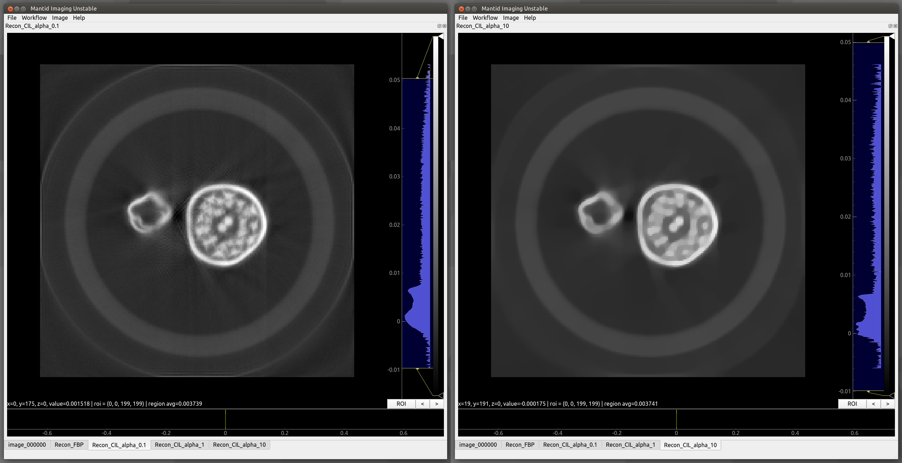

.. _Reconstruction Algorithms:

Reconstruction Algorithms
=========================

Overview
--------

This page gives explanations of different reconstruction algorithms available in Mantid Imaging, including implementation details, hardware requirements, and links to the upstream documentation for the algorithms.

ASTRA Toolbox
-------------

The ASTRA Toolbox provides GPU-accelerated tomographic reconstruction algorithms.

This implementation supports 2D data sets, and requires a CUDA-compatible graphics card to run.

Mantid Imaging automatically creates the required projector and geometry configurations for ASTRA reconstruction workflows.

Parallel beam vector geometry is used, allowing tilt correction to be accounted for through the centres of rotation for each slice. This means manual rotation of the images to correct the tilt shouldn't be necessary.

The vector creation implementation is adapted from `ToMoBAR <https://github.com/dkazanc/ToMoBAR/blob/master/src/Python/tomobar/supp/astraOP.py#L20-L70>`_.

FBP_CUDA
^^^^^^^^

- Filtered back projection reconstruction algorithm
- Supports multiple reconstruction filters 
- Requires a CUDA-compatible GPU

`Link to the original documentation for FBP_CUDA <http://www.astra-toolbox.com/docs/algs/FBP_CUDA.html>`_

For an evaluation of the filters please go to the :ref:`Reconstruction Filters` page.

SIRT_CUDA
^^^^^^^^^

- Simultaneous iterative reconstruction technique (SIRT) algorithm
- Reconstruction quality is controlled through iteration count 
- Requires a CUDA-compatible GPU

`Link to the original documentation for SIRT_CUDA <http://www.astra-toolbox.com/docs/algs/SIRT_CUDA.html>`_.

Mantid Imaging provides a refine iterations tool to assist with selecting an appropriate iteration count.

TomoPy
------

gridrec
^^^^^^^

- CPU-based reconstruction algorithm 
- Does not require CUDA support
- Implemented through the TomoPy package

`Link to original documentation for gridrec <https://tomopy.readthedocs.io/en/latest/api/tomopy.recon.algorithm.html#module-tomopy.recon.algorithm>`_.

References
^^^^^^^^^^

- Dowd BA, Campbell GH, Marr RB, Nagarkar VV, Tipnis SV, Axe L, and Siddons DP. Developments in synchrotron x-ray computed microtomography at the national synchrotron light source. In Proc. SPIE, volume 3772, 224–236. 1999.
- Rivers ML. Tomorecon: high-speed tomography reconstruction on workstations using multi-threading. In Proc. SPIE, volume 8506, 85060U–85060U–13. 2012.

Core Imaging Library
--------------------

The `Core Imaging Library (CIL) <https://www.ccpi.ac.uk/cil>`_ is an open-source Python framework for tomographic imaging with particular emphasis on reconstruction of challenging datasets.

PDHG-TV
^^^^^^^

Primal Dual Hybrid Gradient optimiser with Total Variation regularisation. 

This is an advanced iterative optimised reconstruction algorithm, described in the paper below. The user can adjust regularisation parameter alpha, the figure shows two values of alpha applied to a reconstructed slice.

    PDHG-TV with alpha=0.1 on the left and alpha=10 on the right

- Jørgensen JS et al. 2021 `Core Imaging Library Part I: a versatile python framework for tomographic imaging <https://doi.org/10.1098/rsta.2020.0192>`_. Phil. Trans. R. Soc. A 20200192. Code.
