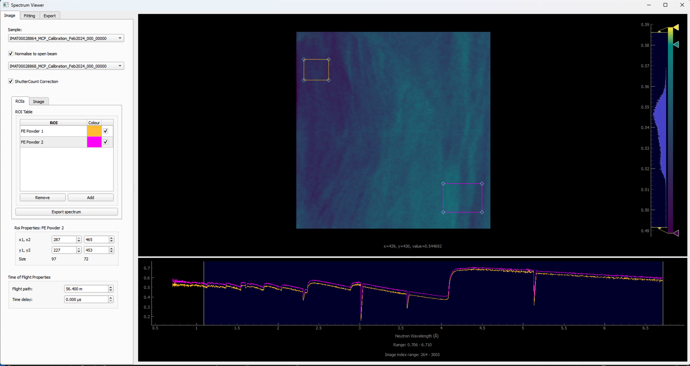

.. _quick-start-time-of-flight-workflow-guide:

Quick Start: Example Time of Flight (ToF) Analysis
-------------------------------------------------------------

Loading Time-of-Flight Data
============================

.. image:: ../../../_static/loading_screen_tof_dataset_dark.png
    :alt: Loading Dialog WIndow with Time-of-Flight Dataset Loaded (Dark)
    :align: center
    :class: only-dark

Minimal Files Required For ToF Quick Start Guide
================================================

- :code:`Sample`: Typical sample file formats to expect here are :code:`.fits` and :code:`.tif`. We also accept :code:`.nxs` files, however the loading steps are different from those below. See the (loading_nexus - ADD LINK LATER) for more information on loading Nexus files.
- Open Beam: This is typically a file that has been collected with no sample in the beam path. This is used to normalise the sample data to the open beam - load either a :code:`Flat Before` or :code:`Flat After` file.
- :code:`Sample / Spectra Log`: For a ToF dataset, this is typically a file that contains the time of flight information for each pixel in the image stack. This is used to map the time of flight data to the image stack.
- :code:`Sample Shutter Counts`: This is typically a file that contains the number of counts for each pixel in the image stack when the sample shutter is open. This is used to normalise the sample data to the sample shutter counts.
- Open Beam Shutter Counts (:code:`Flat Before Shutter Counts` or :code:`Flat After Shutter Counts`): Contains the number of counts for each pixel in the related image stack. This is used to normalise the sample data to the open beam shutter counts. It's important to select the relevant stack based on whether you loaded a :code:`Flat Before` or :code:`Flat After` above.

Spectrum Viewer
###############

.. image:: ../../../_static/spectrum_viewer_dark.png
    :alt: Spectrum Viewer Window (Dark)
    :align: center
    :class: only-dark

The spectrum viewer is a tool that allows you to view spectrum data within a Time of flight (TOF) image stack. To open the spectrum viewer go to :code:`Workflow > Spectrum Viewer`.

**Export Spectrum Data**:

#. Resize the ROI to just cover the size of the sample within your data or a particular area of interest within your sample. This will allow you to see the spectrum within the ROI which you will be able to see in the spectrum line plot at the bottom of the window.

#. Click the :code:`Add` button on the left to add another ROI which you can position over a particular detail of your choosing on the sample.

#. Within the ROI Table, double click :code:`roi_1` to rename to something more descriptive of what the ROI is covering.

#. To remove an ROI, you can select the ROI you would like to remove within the ROI Table and click the :code:`Remove` button on the left.

#. The location and size of ROIs can be finely tuned using the :code:`Roi Properties` table below the table of ROIs. The :code:`Roi Properties` will show the coordinates of the currently selected ROI in the tabel of ROIs.

#. To export spectrum data, you can click the :code:`Export spectrum` button and select a location and filename. Two files will be saved to this location :code:`<filename>.csv` and :code:`<filename>_roi_coords.csv`. :code:`<filename>.csv` contains the spectrum data for each ROI. :code:`<filename>_roi_coords.csv` contains the coordinates of the ROIs in the image stack.

#. If you have a TOF dataset loaded where you would like to normalise to the open beam, you can do so by toggling the :code:`Normalise to open beam` checkbox. This will normalise the spectrum to the open beam spectrum. The greyed out drop down menu will become available and you can select which dataset you would like to use as the open beam.

#. If you have loaded Shutter Count files for your :code:`sample` and  :code:`Flat Before Shutter Counts` or :code:`Flat After Shutter Counts` (dependent on if you loaded a :code:`Flat Before` or :code:`Flat After` image stack), you can also apply :code:`Shutter Count Correction` by clicking on the checkbox. Applying shutter count correction will autoscale the normalised sample against the open beam to acheive more accurate results where counts across stacks differ from one another. The greyed out toggle box will become togglable once :code:`Normalise to open beam` has been toggled to true with a valid open beam dataset selected from the drop-down menu.

#. You can also modify the :code:`Flight path` and an :code:`Time delay` specific to your instrument data under the :code:`Time of Flight Poperties` section at the bottom of the left hand side of the window. The :code:`Flight path` is the distance from the sample to the detector in metres. The :code:`Time delay` is the time delay in microseconds between the start of the ToF measurement and the start of the data acquisition. This is typically used to account for any delays in the data acquisition system.

**Export Single or Binned Spectrum Data in RITS Format**

#. To enter :code:`IMAGE` mode to export single or binned spectrum data in `RITS <https://mlfinfo.jp/bl22/en/GUI-RITS.html>`_ format, you can click the :code:`IMAGE` tab at the top of the table of ROIs.

#. Resize the ROI in the same way as before for exporting regular spectrum data to cover an area of the sample you would like to acquire the spectrum for.

#. Select the output mode from the top drop down menu on the left which replaces the table of ROIs, either :code:`Single Spectrum` or :code:`2D Binned` depending on what you would like to export. 2D binned will bin within the ROI and export the binned data as multi-spectrum data.

    #. If you choose to export as a :code:`2D Binned` you can choose the size of your bin in pixels squared from the drop down menu on the left. You can also select the step size of the bin from the drop down menu. If the step size if the same as the bin size, the binned data will be non-overlapping tiled binning. If the step size is smaller than the bin size, the binned data will be overlapping which will achieve a rolling average.

#. Choose between :code:`Propagated` and :code:`Standard Deviation` from the :code:`Error Mode` drop down box. Propagated will calculate the error from the propagated error of the counts in the spectrum. Standard Deviation will calculate the error from the standard deviation of the counts in the spectrum. The mode you choose will depend on the data you are working with. Optionally, you could export to both modes separately to compare the results.

.. image:: ../../../_static/spectrum_viewer_image_mode_light.png
    :alt: Spectrum Viewer Window (Light)
    :align: center
    :class: only-light

**Changing Units**

#. You can change the units of the spectrum data by right clicking on any spectrum plot within the Spectrum Viewer and selecting :code:`Units`. Available units to convert to are:

- :code:`Image Index`: The index of the pixel in the image stack. 
- :code:`Wavelength`: The wavelength of the neutrons in Angstroms (Selected by default).
- :code:`Energy`: The energy of the neutrons in meV.
- :code:`Time of Flight (μs)`: The time of flight of the neutrons in microseconds.

.. image:: ../../../_static/spectrum_viewer_unit_conversion_dark.png
    :alt: Spectrum Viewer Unit Conversion in ROI Mode 
    :align: center

**Fitting**

#. Select the :code:`Fitting` tab at the top of the Spectrum Viewer window to open the fitting interface. The fitting interface allows you to fit a function to the spectrum data for a selected ROI. The available fitting functions are:

- :code:`Error function`: A simple error function model.
- :code:`Santisteban`: A Santisteban model, which is a common model used in neutron scattering.

#. Clicking the :code:`From ROI` button will create an initial guess and fitting parameters based on the data in the selected ROI. This will populate the fitting parameters table with initial values for the fitting function. The inital fit will be plotted on the spectrum plot for the selected ROI. This initial guess is based on the data in the selected ROI and will be used as a starting point for your selected fitting algorithm.

#. Clicking the :code:`Run fit` button will run the fitting algorithm on the selected ROI data using the initial fitting parameters generated by :code:`From ROI`. The fitted function will be overlayed on the spectrum plot for the selected ROI, allowing you to visually assess the fit.

#. You can then adjust the initial fitting parameters in the table at the bottom left-hand side of the view to refine the fit further. The fitting parameters table allows you to adjust the following parameters:

**Santisteban Fit Example**

.. list-table::
   :widths: 50 50
   :header-rows: 0
   
   * - 
       - **Error Function Parameters**

         .. image:: ../../../_static/spectrum_viewer_fitting_err_func_params_light.png
            :alt: Error Function (Light)
            :class: only-light
            :width: 300px

         .. image:: ../../../_static/spectrum_viewer_fitting_err_func_params_dark.png
            :alt: Error Function (Dark)
            :class: only-dark
            :width: 300px

     - 
       - **Santisteban Parameters**

         .. image:: ../../../_static/spectrum_viewer_fitting_santisteban_params_light.png
            :alt: Santisteban (Light)
            :class: only-light
            :width: 300px

         .. image:: ../../../_static/spectrum_viewer_fitting_santisteban_params_dark.png
            :alt: Santisteban (Dark)
            :class: only-dark
            :width: 300px

.. list-table::
   :header-rows: 1
   :widths: 50 50

   * - **Error Function Parameters**
     - **Santisteban Parameters**
   * - - :code:`mu`: The mean of the fitting function.
       - :code:`sigma`: The standard deviation of the fitting function.
       - :code:`h`: The height or the function or distance from :code:`min(func)` to :code:`max(func)`.
       - :code:`a`: The vertical offset of the function, i.e. the value of the bottom of the ROI.
     - - :code:`t_hkl`: The time of flight for the hkl reflection.
       - :code:`sigma`: The standard deviation of the fitting function.
       - :code:`tau`: The time constant of the fitting function.
       - :code:`h`: The height or the function or distance from :code:`min(func)` to :code:`max(func)`.
       - :code:`a`: The vertical offset of the function, i.e. the value of the bottom of the ROI.
       - :code:`a_0`: The baseline transmission i.e. the transmission value before the Bragg edge (high-wavelength side).
       - :code:`b_0`: The overall baseline transmission (background level), similar to (:code:`a_0`) in the single-edge case.
       - :code:`a_hkl` and :code:`b_hkl`: Describes the jump in the cross-section :code:`sigma_hkl`.

For more information on the Santisteban fitting function, see the paper `Time-of-flight Neutron Transmission Diffraction <https://www.researchgate.net/publication/42793067_Time-of-flight_Neutron_Transmission_Diffraction>`_ .

As of now, the fitting interface is still under development and will be improved in future releases. If you have any feedback on the fitting interface, please do get in touch with us via our support email which can be found on our `GitHub repository <https://github.com/mantidproject/mantidimaging>`_ :code`README`. 