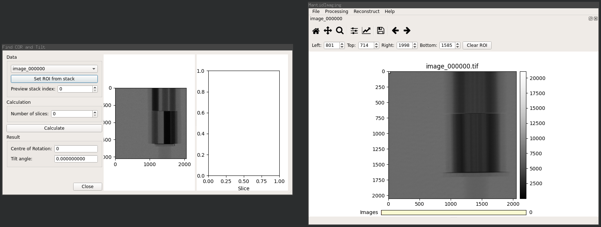
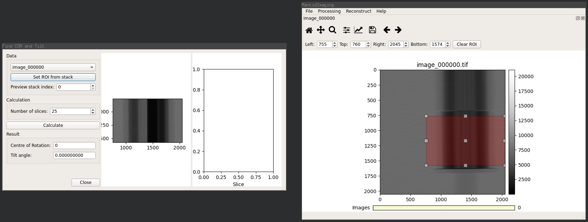
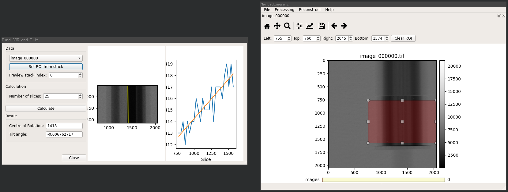

COR and Tilt Finding
====================

This tool is used to determine the centre of rotation (COR) and detector tilt
angle of a sample.

.. note:: It cannot correct for a tilt in the sample relative to the sample
          stage.

Theory
------

A selection of slices along the Y axis (i.e. sinograms) are used to obtain a
mapping of sinogram index to rotation centre.

A linear fit of these values is performed to obtain the rotation centre at the
first sinogram (from the Y axis intercept) and the tilt angle (calculated from
the gradient).

Example
-------

With a stack of projection images loaded, select the *Find COR and Tilt* option
from the *Reconstruct* menu to show the tool, as below:

Firstly a region of interest must be selected around the portion of the sample
that will be used in the rotation centre calculations.

The region must fully enclose the sample on the X axis and be limited to a
single element of the sample in the Y axis. For instance, the bottom cylinder in
the demo shown here.

To ensure that the sample is well enclosed by the region the stack can be
switched to *Sum* mode (by right clicking on the image and selecting *Sum
Mode*). This mode allows you to see the extents of the sample from each
projection angle, as shown in this screenshot:

The region is selected using the ROI selector on the Stack Visualiser then
updated by clicking the *Set ROI from stack* button on the COR and Tilt dialog.
This will crop the preview displayed on the dialog to your selected ROI.

The number of rotation centres to use in the linear fit is defined by the
*Number of slices* option. Good results typically need at least 20 samples.

When the parameters are set click *Calculate* to perform COR and tilt angle
finding.

Results are shown in the *Centre of Rotation* and *Tilt angle* fields, where the
tilt angle is in radians):

.. note:: The centre of rotation is given relative to the entire image, not the
          selected region of interest.
