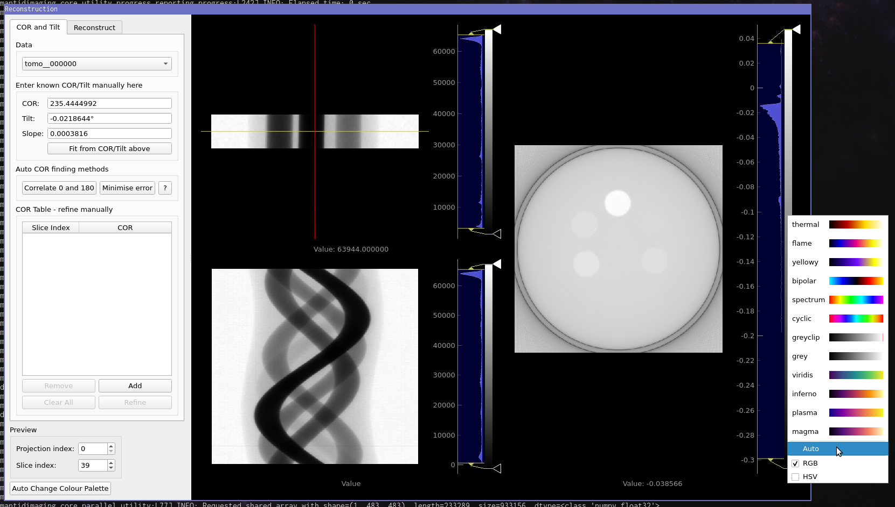

Image view
==========

The image view widget is used in many places in Mantid Imaging to display individual images and image stacks. It is based on ImageView from PyQtGraph and allows fast interaction with large datasets.

.. image:: ../../_static/image_view.png
    :alt: Image view in main window
    :width: 70%
    :align: center

To the right of image the histogram viewer allows controlling how the current image is displayed. Below the image is the stack control which to select which image in the stack is displayed.

Navigation
----------

For the best experience a mouse with a scroll wheel is recommend.

* Panning: Click and drag with the left or middle mouse button
* Zooming: Either use the scroll wheel or click and drag with the right mouse button
* Moving through stack: Left click in the stack control area below the image or use the arrow or page-up page-down keys.
* Reset view: Right click and select View All

On some trackpads without a scroll feature it may be helpful to enable "1 button" mouse option, by right clicking and selecting "Mouse Mode". This enables zooming by drawing a box with the left mouse button.

Histogram
---------

.. image:: ../../_static/image_view_histogram.png
    :alt: Controlling the histogram the image view
    :width: 90%
    :align: center

The histogram viewer controls how the pixel values in the image are displayed on the screen. The histogram shows the number of pixels for each intensity value. In the above image most of the pixels have values distributed around 10000 and structure in the histogram can be seen between zero and 10000. A few bright spots above 10000 are visible in the image.

The yellow bars (labelled 'A' above) set the range of interest. Moving the top bar down to around 15000 allows far more of the detail to be seen, at the expense of making the bright specs less visible. This selected range is then coloured according the selected gradient, here black to white greyscale.

The control ticks (triangles labelled 'B' above) can be moved around to customise the gradient. Control ticks can be added by left-clicking and removed by right-clicking and selecting "Remove Tick".

Alternative colour schemes can be selected by right-clicking on the gradient as shown below. It is also possible to choose if the gradient interpolation between ticks occurs in Red-Green-Blue (RGB) or Hue-Saturation-Value (HSV) colour space.

.. image:: ../../_static/image_view_colour.png
    :alt: Selecting colours for the image view
    :width: 70%
    :align: center

Colour Palette
--------------

The colour palette of an image can be changed by right clicking its histogram. This allows users to choose from a number
of pre-defined gradients.

Automatic Gradient Tweaking
---------------------------

Users can also use the Jenks Breaks or Otsu algorithms to automatically change the appearance of the gradient. The
software will then attempt to categorise the image into groups and select colours that emphasise the contrast between
the different materials in the image. In some cases, this may make the different materials in the image more easy to
distinguish from one another. Be aware that the success of the algorithm greatly depends on how much the histogram
cooperates.

This feature can be accessed by right clicking the projection histogram in the recon window and selecting "Auto", or
by clicking on the "Auto Change Colour Palette" button in the bottom-left corner. This is shown below:

This then brings up the auto colour palette menu. From here you can choose the number of materials, the algorithm you
wish to use, and the desired colour map. The default colour map is "spectrum" as it appears to be best-suited to taking
the results of Otsu/Jenks and choosing colours that emphasise the separateness of the different regions. Note that
changing the colour map only provides a cosmetic difference and does not influence the results of the algorithm. Users
should note that the execution time of the algorithm increases greatly with the input value for the number of materials.

.. image:: ../../_static/auto_colour_palette_menu.png
    :alt: The auto colour palette menu
    :width: 50%
    :align: center
