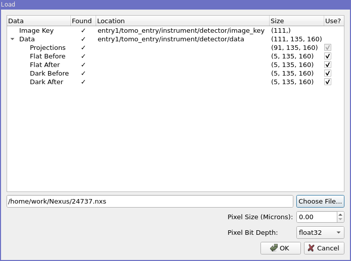

Loading and Saving
==================

Loading sand saving data is performed via the *Load dataset* and *Save* options on the
*File* menu.

Loading
-------

When *Load dataset* is selected, the following dialog will appear:

.. image:: ../../_static/loading_screen.png
    :alt: Initial Load dialog

This allows you to select the data you wish to load; The Sample entry should be used to select the first projection TIFF file, the remaining TIFF files in the directory will be automatically detected if their filename matches the pattern. The loading dialog will try to automatically find associated files including flat fields, dark frames, 180 degree projections and sample logs.

Once data has been selected, its shape is inspected and the stack index fields
are populated as shown below:

.. image:: ../../_static/loading_screen_filled.png
    :alt: Load dialog after selecting data

The *Start* and *End* fields control the range of images that are loaded and
*Increment* defines the interval at which images are selected.

To quickly load only 10 images from a stack, press the preview button, which will set a large enough *Increment*.

*Pixel Bit Depth* is used for the estimated memory size calculation, typically
images will use 32bit floating point numbers as the pixel format so this can be
left at the default value of *float32*.

Saving
------

The *Save* option is only enabled when at least one stack is loaded.

When selected the save dialog appears:

.. image:: ../../_static/gui_save_dialog.png
    :alt: Save dialog

This prompts you to select the image stack you wish to save, the directory in
which you wish to save it and the name prefix. In the case of TIFF and FITS the
individual image filenames will be a concatenation of this prefix and the index
of the image in the stack.

The *Overwrite* option removes checking for existing data of the same name. When
disabled an error will be raised if the specified output directory is not empty
prior to saving.

NeXus Files
-----------

NeXus Files can be loaded by selecting the "Load NeXus file" on the File menu. This brings up the NeXus Load dialog
shown below.

From here you can choose a NeXus file that you wish to load. The program will then scan its contents and check for a
:code:`NXtomo` entry. If an entry is found, information about the file will be displayed in the dialog. The data sizes
are also displayed so that a user can check that the image key and data field have the same number of elements. The
"Use?" checkbox can be used to select which images you wish to load.

If the required information could be found in the file, then the OK button will be enabled. Otherwise the button will be
disabled.

From here, you can press OK to load the file as a dataset. The name given to the images will be taken from the
:code:`title` field in the NeXus file if one is found, otherwise the images are given the name "NeXus Data."
