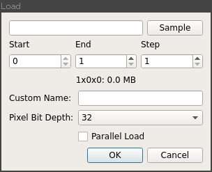
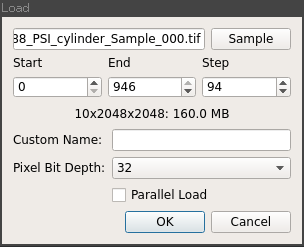
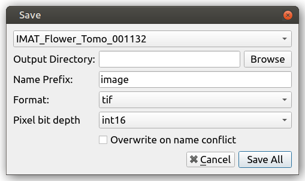

Loading and Saving
==================

Loading sand saving data is performed via the *Load* and *Save* options on the
*File* menu.

Loading
-------

When *Load* is selected, the following dialog will appear:

This allows you to select the data you wish to load; in the case of TIFF or FITS
images then any image in a directory containing an image stack can be selected
or a single NeXus file if loading from NeXus.

Once data has been selected, it's shape is inspected and the stack index fields
pre populated as shown below:

The *Start* and *End* fields control the range of images that are loaded and
*Step* defines the interval at which images are selected.

A default is set once data has been selected that specifies 10 images over the
full stack of images.

The *Custom Name* option allows you to specify a name for the loaded image stack
manually, if none is provided then a default name derived from the filename will
be used.

*Pixel Bit Depth* is used for the estimated memory size calculation, typically
images will use 32bit floating point numbers as the pixel format so this can be
left at the default value of *32*.

*Parallel Load* attempts to load the images in parallel, however on IO limited
systems this can prove slower than a sequential load, hence it is recommended
not to enable this option.

Saving
------

The *Save* option is only enabled when at least one stack is loaded.

When selected the save dialog appears:

This prompts you to select the image stack you wish to save, the directory in
which you wish to save it and the name prefix. In the case of TIFF and FITS the
individual image filenames will be a concatenation of this prefix and the index
of the image in the stack.

The *Overwrite* option removes checking for existing data of the same name. When
disabled an error will be raised of the specified output directory is not empty
prior to saving.

*Swap Axes* is used to convert between projection and sinogram indexed image
stacks.
