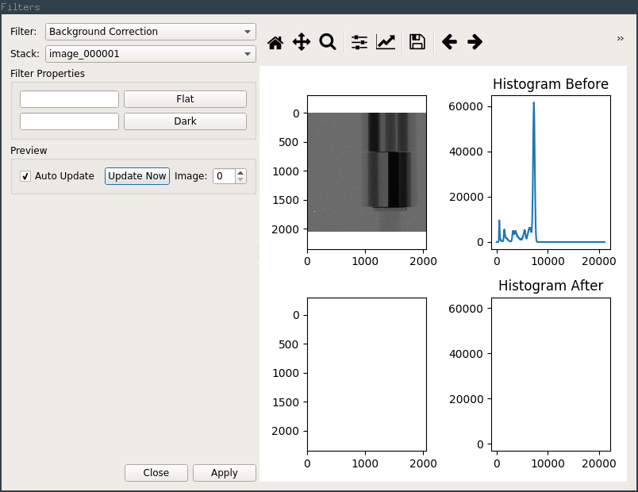
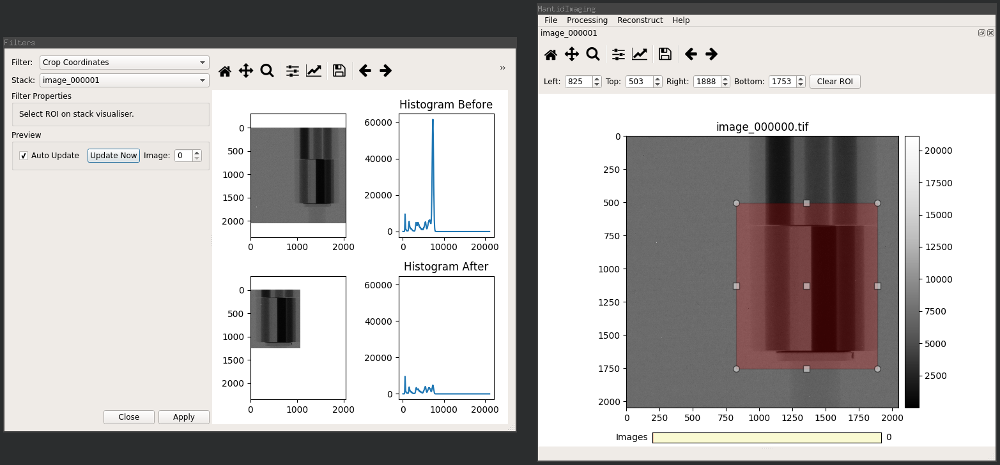

Operations
==========

Selecting the *Operations* option in the *Processing* menu opens the filters
dialog, this is used for applying filters to image stacks.

Operations may be applied to image stacks of any type (i.e. projection, sinogram,
reconstruction), they are essentially just image filters and do not directly
care about the type of image.

Here you can select the type of filter and the image stack you wish to apply it
to, properties of the selected filter are automatically shown in the *Filter
Properties* section.

The right hand panel shows a preview of the image and intensity histogram before
and after application of the filter. The toolbar above this section behaves in
the same way as the toolbar on the Stack Visualiser.

The pan and zoom of both image and histogram plots are linked for fine
inspection of the effects of the filter.

The *Image* control in the *Preview* section can be used to select the index of
the image in the stack that is used to generate the preview.

Operations are automatically updated when parameters are changed. For filters that
take a long time to apply even on a single image it is worthwhile to disable the
*Auto Update* option and trigger preview updates manually using the *Update Now*
button.

For filters that use a region of interest as a parameter (namely Crop
Coordinates and ROI Normalisation) the ROI is selected using the controls on the
stack visualiser for the selected image stack (as shown in the screenshot below).

Pressing *Apply* applies the filter to every image in the stack, replacing the
data in the stack.

It is normal for this to take a significant amount of time for a large stack of
images.

The application of a filter can not be undone.
