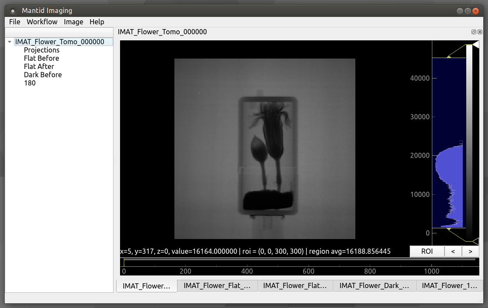

Quick Start
===========

The GUI is stared from a terminal using the command :code:`mantidimaging-gui`.

When the GUI is running an amount of logging output will be produced in the
terminal from which it was started. This can be useful in identifying issues you
may encounter when using the GUI and should be recorded when such issues arise.

The verbosity of logging information that is output can be controlled using the
:code:`--log-level LVL` option when starting the GUI, where :code:`LVL` is one
of :code:`DEBUG`, :code:`INFO`, :code:`WARNING`, :code:`ERROR` or
:code:`CRITICAL`. For example :code:`mantidimaging-gui --log-level DEBUG` will
output more logging information that the default (at the expense of execution
time).

The *Help* menu contains a link to this online documentation.
