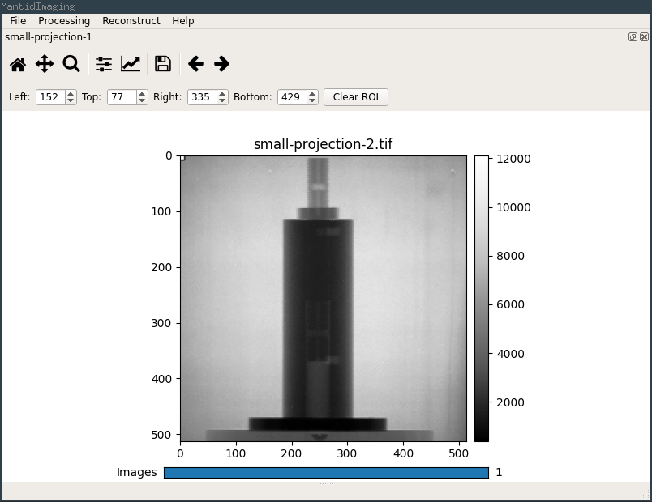
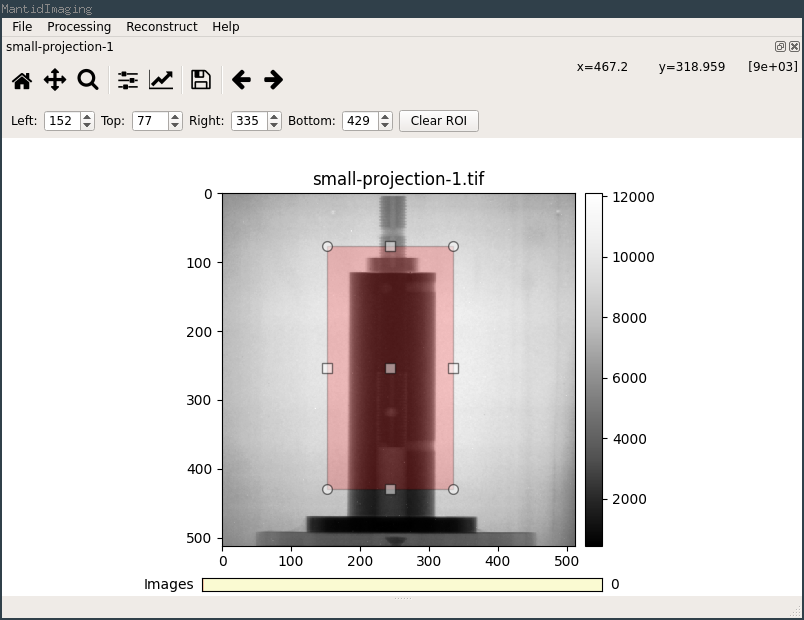
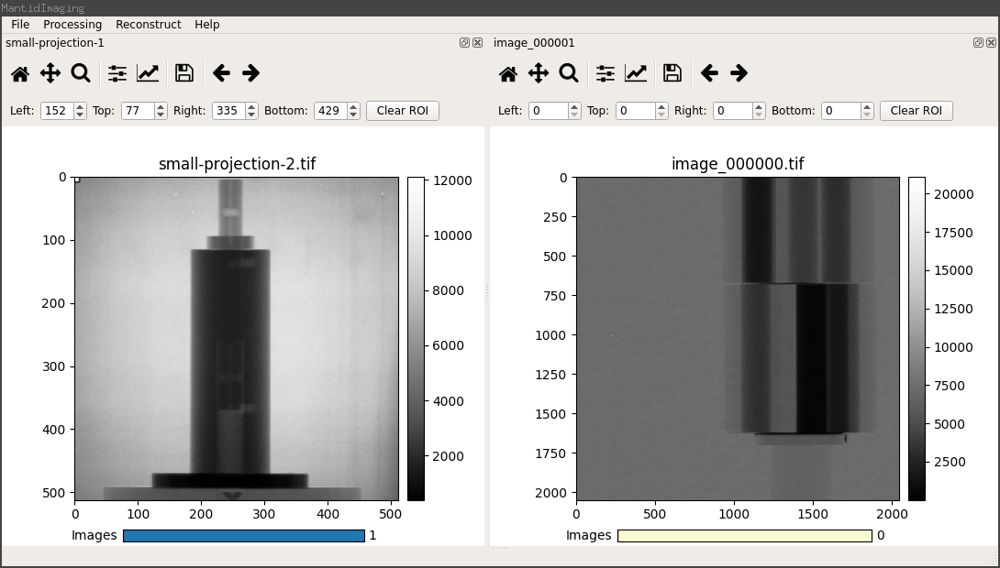
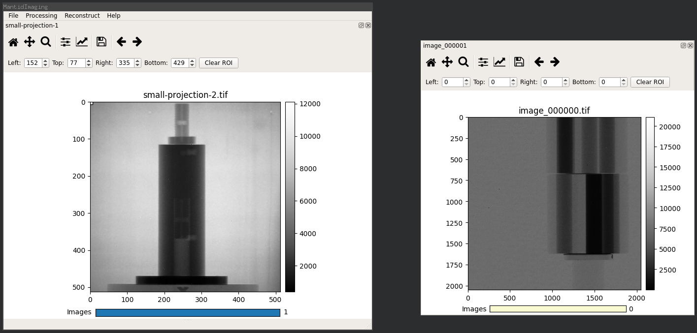

Stack Visualiser
================

The stack visualiser is the main way to view loaded images in the GUI.

Stack visualiser windows are created automatically when data is loaded or
produced by an operation (e.g. volume reconstruction).

This screenshot shows a single stack visualiser docked inside the main window
after loading a small image stack:

.. image:: ../../_static/gui_stack_vis.png
    :alt: Stack visualiser
    :width: 50%

The first 6 buttons on the toolbar are standard Matplotlib tools; reset view,
pan, zoom, canvas layout, axes options and save plot. The last two arrow buttons
can be used to scroll through the image stack.

You can also scroll through the stack using the mouse wheel or the *Images*
slider at the bottom of the window.

A Region of Interest (ROI) can be selected by clicking and dragging on the image
or by entering values in the ROI toolbar.

When additional image stacks are loaded the additional stack visualisers are
docked into the main window along with any existing stacks.

The main window can hold as many stack visualisers as required which can be
docked side by side, in tabs or floating (as shown in the screenshot below).
Stack visualisers are moved and docked using the title bar above the Matplotlib
toolbar.

Right clicking on the image in a stack visualiser opens a context menu which
allows plotting the intensity histogram and switching between stack and sum
modes.

In stack mode each image is displayed individually and the images in the stack
can be scrolled through normally.

In sum mode the normalised sum of each image is displayed. This mode is useful
for selecting a region of interest that definitely covers the entire sample or a
region that is definitely an air region in all images.
