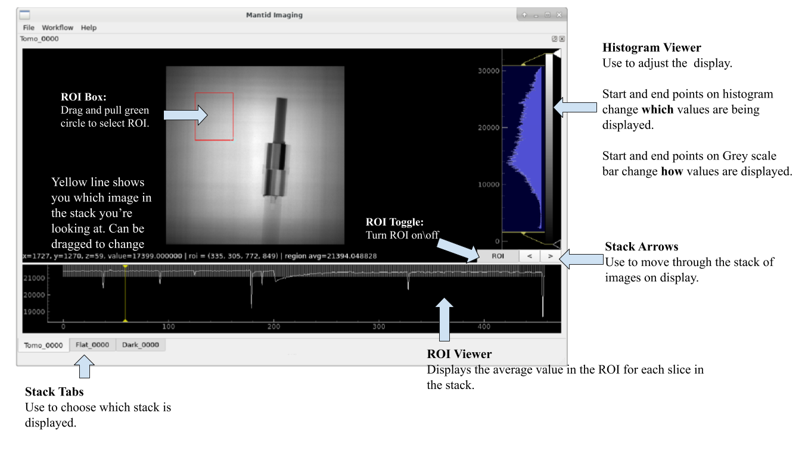

User Guide
==========

.. toctree::
   :maxdepth: 1
   :caption: Contents:

   operations/index
   gui/index
   reconstructions/index

Mantid Imaging User Guide: Example Reconstruction
-------------------------------------------------

Written: November 2020

Author: Arianna Wintle (STFC)

Please email any suggestions to mantidimagingsupport@stfc365.onmicrosoft.com

Loading Sample Stack
####################

Firstly, let's load our projections. Go to "File" then "Load" or alternatively use the shortcut "Ctrl"+"o". This brings up the following loading screen:

.. image:: ../_static/loading_screen.png
    :alt: Loading screen
    :width: 70%
    :align: center

#. Click select on the sample row and go to the directory you want to load. We'll be working with the "Tilt 4 pre reco" data set.
#. Open one of the images with the prefix "Tomo".
#. All images with the prefix "Tomo" in the same area will be loaded

Mantid Imaging should at this stage search the directory for all the files with prefixes like "Flat" and "Dark" and put them in the correct category. If this is missed or simply stored in a different location, the above steps can be repeated to find and load these.

At this stage there is also the option to:

#. Open only a portion of the sample images. This can be done by manually selecting the file indices or using the "Preview" Button which will set the file indices to a suitable selection.
#. Select the pixel size of the detector used in microns. This can also be changed at a later stage.
#. Untick a category of files to not load. For example, if both "Dark Before" and "Dark After" images have been found this can be adjusted to only one.

Project Window
##############

Operations
##########

Next let's take the sample we loaded and let's tidy it up with operations. To open the operations go to "Workflow" then "Operations".

1. **Remove Outliers** will be the first operation we will apply. This has to be completed in 2 modes "Bright" and "Dark". We'll complete this for both modes with difference set to 1000 and median kernel set to size 3. Apply this to all stacks.
   - The difference value is used to find outliers, and will have to be adjusted depending on the values in your data.

2. **Flat Fielding** As we only have one set of flat and dark images we will set the flat fielding method to "Only Before". With safe apply checked running this operation opens the following window:
   - Safe Apply window showing before flat fielding on the left and after flat fielding on the right. Allowing us to see the result of the operation before applying it. Next select "Choose New Data" to apply operation.

.. image:: ../_static/flat_fielding.png
   :alt: Flat fielding with Safe Apply option turned on
   :align: center

3. **ROI Normalisation** After going to this operation we're able to click "Select ROI" and set our ROI to a space free of any sample. This operation will result in a much greater consistency between projections visible in the ROI viewer.
4. **Crop Coordinates** Next we will crop the stack to contain the sample only by selecting a ROI as in the following.

.. image:: ../_static/Crop.png
   :alt: ROI that needs to be selected for the crop
   :align: center
   :width: 70%

At this point we have a sample ready to reconstruct. Note operations such as a median filter could be used here, but in an effort to conserve grey value as accurately as possible it was avoided.

Reconstruction
##############

To open the reconstruction window, go to "Workflow" then "Reconstruct". This should open onto the "COR and Tilt" tab. For the reconstruction we will be manually finding the COR and tilt values. The best way to do this is be to use the \textbf{COR Table}.

1. First select a slice index close to the top of the sample using the Preview box at the bottom of the reconstruction window.
2. Then press the "Add" button at the bottom of the screen. This should add your slice to the table.
3. Press the "Refine" button whilst selecting this slice. This brings up the following window:

.. image:: ../_static/refine_window.png
   :alt: Loading screen
   :align: center

4. Continue by selecting which window shows the most accurate depiction of the sample. Mantid image will highlight the window it feels is best in green.
5. Repeat for a slice at the bottom.
6. After this the "Calculate COR/Tilt from slice COR table" will now be selectable. Feel free to repeat the process for intermediate slices before pressing this button.

Now move to the "Reconstruct" tab. At this stage there should several different settings to use. For this sample use the following settings.

- Maximum Projection Angle: 360.00
- Algorithm: FBP-CUDA
- Reconstruction filter: hann
- Pixel size (microns): 103

There are many filter options. Experiment with the filters by looking at the slice preview and the corresponding hitogram next to it. Filters like "hann" will strongly filter out higher frequency components. In contrast "ram-lak" preservers these higher frequency components resulting in a visibly less smooth histogram.

Then click "Reconstruct Volume" to complete the reconstruction.
