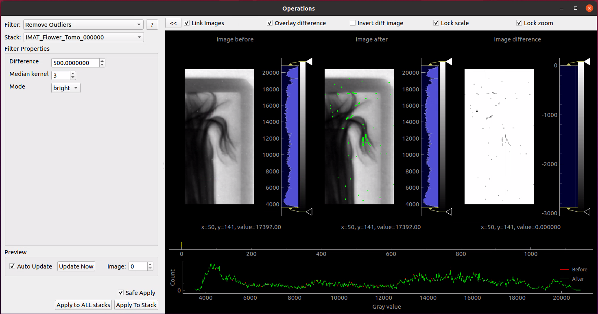
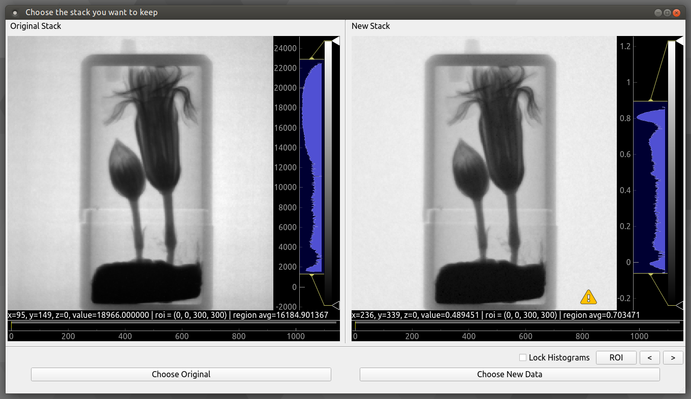
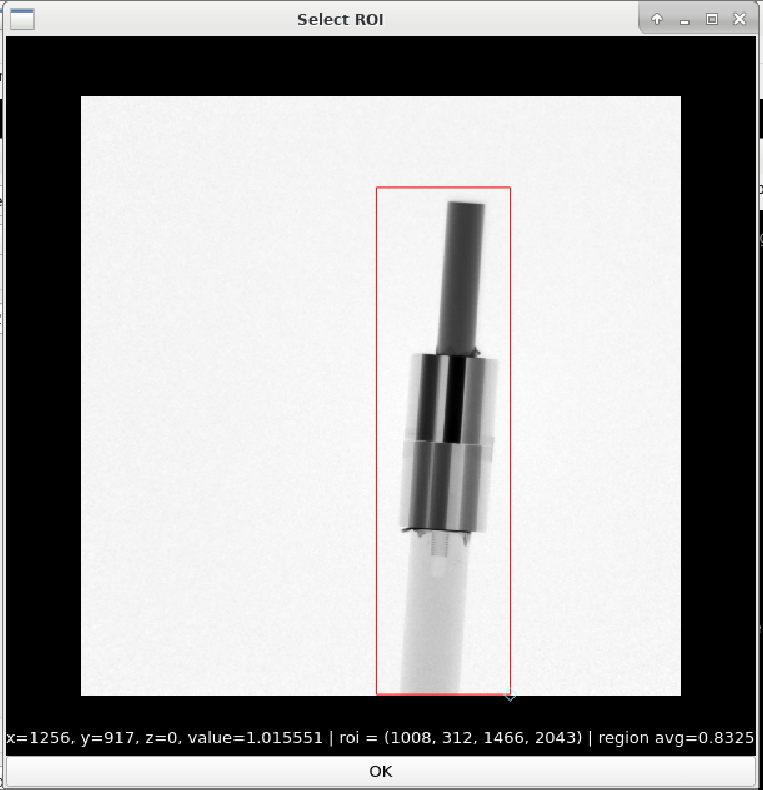

Quick start: Example Reconstruction
-----------------------------------

Written: November 2020

Author: Arianna Wintle (STFC)

Example data that can be used for this tutorial can be downloaded from `github.com/mantidproject/mantidimaging-data <https://github.com/mantidproject/mantidimaging-data/archive/refs/heads/main.zip>`_

Loading Sample Stack
####################

Firstly, let's load our projections. Go to "File" then "Load Dataset" or alternatively use the shortcut "Ctrl"+"o". This brings up the following loading screen:

.. image:: ../_static/loading_screen.png
    :alt: Loading screen
    :width: 70%
    :align: center

#. Click select on the sample row and go to the directory you want to load. We'll be working with the "IMAT00010675" flower data set which can be found in the ISIS/IMAT directory in the above download.
#. Open one of the images with the prefix "Tomo".
#. All images with the prefix "Tomo" in the same directory will be loaded

Mantid Imaging will search the directory for all the files with prefixes like "Flat" and "Dark" and put them in the correct category.
Another location that is checked is the parent directory - it will search for folders names "Flat" and "Dark" there, and use those images for each one, respectively.
If they are missed or stored in a different location, the above steps can be repeated to find and load these.

At this stage there is also the option to:

#. Open only a portion of the sample images. This can be done by manually selecting the file increment or by using the "Preview" Button.
#. Select the pixel size of the detector used in microns. This can also be changed at a later stage.
#. Untick a category of files to not load. For example, if both "Dark Before" and "Dark After" images have been found this can be adjusted to only one.

Read more about loading in :ref:`Loading and Saving`.

Project Window
##############

.. image:: ../_static/gui_main_window.png
    :alt: View of the application window
    :align: center

The main window allows you to view the currently loaded image stacks and gives access to operations and reconstruction tools.

Read more about using and navigating in the :ref:`Image view`.

Operations
##########

Next let's take the sample we loaded and let's tidy it up with operations. To open the operations go to "Workflow" then "Operations".

1. **Remove Outliers** will be the first operation we will apply. This has to be completed in 2 modes "Bright" and "Dark". We'll complete this for both modes with difference set to 500 and median kernel set to size 3. Apply this to all stacks.
    - The difference value is used to find outliers, and will have to be adjusted depending on the values in your data, and how aggressive you want the filter to be.
    - Safe Apply is enabled by default and it will show a window containing the original data and the processed data. This allows us to see the result of the operation before applying it. Choose the new data to proceed.

2. **ROI Normalisation** After going to this operation we're able to click "Select ROI" and set our ROI to a space free of any sample. This operation will result in a much greater consistency between projections visible in the ROI viewer.

3. **Flat Fielding** As we only have one set of flat and dark images we will set the flat fielding method to "Only Before". With safe apply checked running this operation opens the following window:
    - Safe Apply window showing before flat fielding on the left and after flat fielding on the right. Next select "Choose New Data" to apply operation.

4. **Crop Coordinates** Next we will crop the stack to contain the sample only by selecting a ROI as in the following.

At this point we have a sample ready to reconstruct. Note: operations such as a Median Filter could be used here, but in an effort to conserve grey value as accurately as possible it was avoided. To see the list of available operations go to the :ref:`Operations` help page and for more details on the GUI see :ref:`Operations Window`.

Reconstruction
##############

To open the reconstruction window, go to "Workflow" then "Reconstruct". This should open onto the "COR and Tilt" tab. The reconstruction window provides 2 automatic methods COR/Tilt finding, read more about them here: :ref:`Center of Rotation`.

For this reconstruction we will be manually finding the COR and tilt values. The best way to do this is to use the **COR Table**.

1. First select a slice index close to the top of the sample by clicking on the projection image (the top left image from the 3 visible in the window), or dragging the yellow line.

   - Alternatively you can use the Preview box at the bottom of the reconstruction window.

2. Then press the "Add" button at the bottom of the screen. This should add your slice to the table.
3. Press the "Refine" button whilst selecting this slice. This brings up the following window:

.. image:: ../_static/refine_window.png
   :alt: Loading screen
   :align: center

4. Continue by selecting which image shows the most accurate depiction of the sample. Mantid Imaging will highlight the image it feels is best in green. This can be inaccurate for very noisy samples, but should be accurate for this dataset.
5. Select another slice at the bottom of the sample, "Add" it to the table.  As soon as you add the 2nd slice it will perform a fit for the COR and tilt. This will not be accurate - select the newly added row and repeat the refine.
6. Once you find a good COR and confirmed with "Finish", the fit should be automatically performed to the new COR you found.

Now move to the "Reconstruct" tab. At this stage there should several different settings to use. For this sample use the following settings.

- Maximum Projection Angle: 360.00
- Algorithm: FBP-CUDA
- Reconstruction filter: hann
- Pixel size (microns): 103

There are many filter options. Experiment with the filters by looking at the slice preview and the corresponding histogram next to it. Filters like "hann" will strongly filter out higher frequency components. In contrast "ram-lak" preserves these higher frequency components resulting in a visibly less smooth histogram.

Then click "Reconstruct Volume" to complete the reconstruction. This should take about 5 minutes.

For more details on the reconstruction GUI see :ref:`reconstruction window`

Post-reconstruction
###################

Once the reconstruction is finished, the data will be automatically divided by the pixel size, so the resulting images will contain the attenuation values. At this point
you can apply some post-processing operations (such as circular mask), or just save out the stack with File > Save (or CTRL+S), in order to visualise it as a 3D volume in another software.

Spectrum Viewer
###############

.. image:: ../_static/spectrum_viewer.png
    :alt: Spectrum Viewer Window
    :align: center

The spectrum viewer is a tool that allows you to view spectrum data within a Time of flight (TOF) image stack. To open the spectrum viewer go to Workflow > Spectrum Viewer.

**Export Spectrum Data**:

#. Resize the ROI to just cover the size of the sample within your data or a particular area of interest within your sample. This will allow you to see the spectrum within the ROI which you will be able to see in the spectrum line plot at the bottom of the window.

#. Click the "Add" button on the left to add another ROI which you can position over a particular detail of your choosing on the sample.

#. Within the ROI Table, double click "roi_1" to rename to something more descriptive of what the ROI is covering.

#. To remove an ROI, you can select the ROI you would like to remove within the ROI Table and click the "Remove" button on the left.

#. To export spectrum data, you can click the "Export spectrum" button and select a location and filename. Two files will be saved to this location <filename>.csv and <filename>_roi_coords.csv. <filename>.csv contains the spectrum data for each ROI. <filename>_roi_coords.csv contains the coordinates of the ROIs in the image stack.

#. If you have a TOF dataset loaded where you would like to normalise to the open beam, you can do so by toggling the "Normalise to open beam" checkbox. This will normalise the spectrum to the open beam spectrum. The greyed out drop down menu will become available and you can select which dataset you would like to use as the open beam.

**Export Single or Binned Spectrum Data in RITS Format**

#. To enter IMAGE mode to export single or binned spectrum data in RITS format, you can click the "IMAGE" tab at the top of the table of ROIs.

#. Resize the ROI in the same way as before for exporting regular spectrum data to cover an area of the sample you would like to acquire the spectrum for.

#. Select the output mode from the top drop down menu on the left which replaces the table of ROIs, either "Single Spectrum" or 2D Binned" depending on what you would like to export. 2D binned will bin within the ROI and export the binned data as multi-spectrum data.

    #. If you choose to export as a "2D Binned", you can choose the size of your bin in pixels squared from the drop down menu on the left. You can also select the step size of the bin from the drop down menu. If the step size if the same as the bin size, the binned data will be non-overlapping tiled binning. If the step size is smaller than the bin size, the binned data will be overlapping which will achieve a rolling average.

#. Choose between "Propagated" and "Standard Deviation" from the "Error Mode" drop down box. Propagated will calculate the error from the propagated error of the counts in the spectrum. Standard Deviation will calculate the error from the standard deviation of the counts in the spectrum. The mode you choose will depend on the data you are working with. Optionally, you could export to both modes separately to compare the results.
